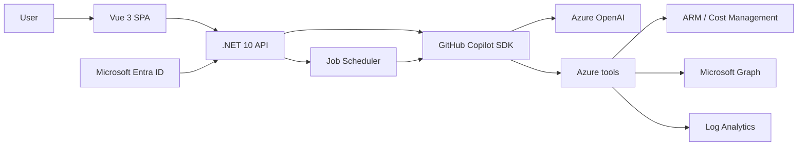

# Azure FinOps Agent

[](LICENSE)
[](https://github.com/Azure-Samples/azure-finops-agent/releases/latest)
[](https://dotnet.microsoft.com)
[](https://vuejs.org)

**Turn Azure cost, governance, and optimization work into a conversation.**

Azure FinOps Agent analyzes live Azure data, scores FinOps maturity, finds savings, creates charts and executive decks, and generates reviewable remediation scripts. It can read and apply approved non-destructive changes with the signed-in user's delegated permissions; it never deletes Azure resources.

[Try the hosted demo](https://azure-finops-agent.com) · [View the presentation](https://azure-finops-agent.com/slides)


## Capabilities

- Live cost, budget, Advisor, Resource Graph, reservation, and savings-plan analysis
- Crawl / Walk / Run FinOps maturity scoring with evidence
- Microsoft Graph, Log Analytics, and Cost Export integrations through incremental consent
- Bounded Microsoft 365 Copilot activity counts and inactive-user lists, with report dates and pagination
- Deterministic token, storage, backup and run-rate calculations with explicit units, currencies and assumptions
- Public Azure pricing and service-health questions without signing in
- CSV, TSV, JSON, XLSX, PDF, Parquet, and image analysis
- Scheduled background jobs with durable run history
- Charts, HTML presentations, and reviewable Azure CLI or PowerShell scripts
- Filtered multi-column file analysis with real CSV, XLSX, and HTML downloads
- Quota, SKU-restriction, placement, and VM-origin connectivity diagnostics
- Exact-change approval and durable status tracking for ARM writes

### Example questions

- "Which resources and meters account for my spend over the last seven days?"
- "Compare the ten cheapest regions for this VM, using the same on-demand meter."
- "List licensed users with no reported Copilot activity in the last 30 days."
- "Analyze this cost export and give me a downloadable report with the full results."
- "Generate a dry-run PowerShell script for the optimization we just discussed."

### Evidence and completion

- **Billing versus estimates:** billed costs, periodically evaluated budget snapshots, public prices, and token-based estimates are different evidence. Answers should preserve the source date, scope, currency and units; missing data is not zero.
- **Pricing coverage:** cheapest-region lookups rank compatible price variants before limiting the returned rows. Incomplete catalogue coverage stays explicit; Spot, Windows and ordinary on-demand prices are not interchangeable.
- **License activity:** Copilot reports cover licensed users and can lag current assignments or anonymize identities. No reported activity is not proof that a license can be removed or that a financial saving is achievable. Report access requires the matching delegated consent and a supported Microsoft Entra role.
- **Usable deliverables:** scripts and reports are real owner-bound downloads, retained for 24 hours. An expired download needs regeneration, not another internal filesystem link.
- **Honest completion:** a finished request is not proof the user's problem was solved. Failed tools, partial data and unavailable permissions remain visible; proposed changes still require application approval.

See the [tool and prompt catalog](docs/tool-catalog.md) for the 38 tools, their supported inputs and coverage limits.

## Architecture



The app runs as a Linux container on Azure App Service. Azure Developer CLI provisions Azure Container Registry, Azure OpenAI, monitoring, managed identities, RBAC, App Service, and the optional Entra application.

The runtime exposes only registered host tools, without built-in shell or cross-session memory access. Run one active application instance: session gates and cooldown coordination are process-local. See [reliability contracts and verification](docs/agent-reliability.md).

## Deploy to your Azure subscription

### Prerequisites

- [Azure CLI](https://learn.microsoft.com/cli/azure/install-azure-cli)
- [Azure Developer CLI](https://learn.microsoft.com/azure/developer/azure-developer-cli/install-azd)
- An Azure subscription where you can create resources and role assignments
- Permission to create an Entra app registration, or an existing app registration to reuse

### Deploy

```powershell
az login --tenant <tenant-id>
az account set --subscription <subscription-id>
azd auth login
azd up
```

`azd up` prompts for an environment and region, provisions the stack, builds the image in ACR, and prints the application URL. To reuse existing resources or change defaults, use `azd env set`; see [Azure deployment permissions](docs/azd-up-permissions.md) and [azure.yaml](azure.yaml).

Remove the deployment with:

```powershell
azd down --purge
```

## Try without Azure access

- Ask a public pricing or Azure service-health question.
- Upload a sample from [demo-data](demo-data/README.md).

## Run locally

### Prerequisites

- [.NET 10 SDK](https://dotnet.microsoft.com/download/dotnet/10.0)
- [Node.js 22+](https://nodejs.org/)
- Azure CLI authenticated to the tenant containing your Azure OpenAI resource

The local Azure CLI identity also needs **Cognitive Services OpenAI User** on the configured model account. Azure management roles such as Owner do not include model-inference data permissions. This access is separate from signing into your Azure tenant in the browser; see [local model authorization](CONTRIBUTING.md#local-model-authorization).

### Configure

```powershell
cd src\Dashboard
dotnet user-secrets set "AzureOpenAI:Endpoint" "https://<your-resource>.openai.azure.com/"
dotnet user-secrets set "AzureOpenAI:DeploymentName" "<your-deployment>"
```

Optional settings:

- `AzureOpenAI:TenantId` when the model resource is in a different tenant from the Azure CLI default
- `Microsoft:ClientId`, `Microsoft:ClientSecret`, and `Microsoft:TenantId` to enable Azure sign-in locally
- `ApplicationInsights:ConnectionString` for telemetry

### Build and run

```powershell
cd src\Dashboard\frontend
npm ci
npm run build

cd ..
$env:ASPNETCORE_ENVIRONMENT = "Development"
dotnet run --urls http://localhost:5000
```

Open [http://localhost:5000](http://localhost:5000).

Build the frontend before starting the backend so the static web root exists at startup. The [contributor guide](CONTRIBUTING.md#regression-tests) covers backend, Python, frontend and rendered desktop/mobile regression tests.

## Investigate answer-quality issues

Maintainers can run [`/investigate-ai-sessions`](.github/prompts/investigate-ai-sessions.prompt.md) in VS Code to:

1. Establish authorized access to one complete owner-bound conversation.
2. Review 100 distinct populated sessions, or disclose an available-history shortfall.
3. Separate full tool evidence from historical message-only records and explicit test traffic.
4. Identify recurring task-completion blockers, verify API contracts, and implement regression-tested local fixes.

The audit does not impersonate users, commit customer transcripts, or deploy automatically. Use [`/investigate-logs`](.github/prompts/investigate-logs.prompt.md) for exception-focused triage. See [reliability contracts and verification](docs/agent-reliability.md) for known limitations.

## Security

- OAuth uses PKCE, nonce validation, incremental delegated consent, and explicit resource scopes.
- The user's Azure RBAC and consented scopes remain the effective authorization boundary.
- Azure `DELETE` and mutating action `POST` operations are blocked in code.
- Generated downloads and session transcripts are ownership-checked.
- ARM writes require explicit review in the application; chat text and scheduled prompts cannot approve them.
- Budget figures can lag billing, and quota/placement evidence does not guarantee an allocation.
- Production secrets belong in managed identities, App Service settings, or GitHub Actions secrets—not in source control.

See [SECURITY.md](SECURITY.md) for reporting vulnerabilities and [docs/session-management.md](docs/session-management.md) for session behavior.

## Contributing

See [CONTRIBUTING.md](CONTRIBUTING.md), [SUPPORT.md](SUPPORT.md), and the [Code of Conduct](CODE_OF_CONDUCT.md).

## License

[MIT](LICENSE)
