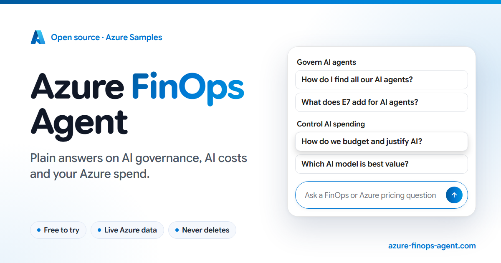
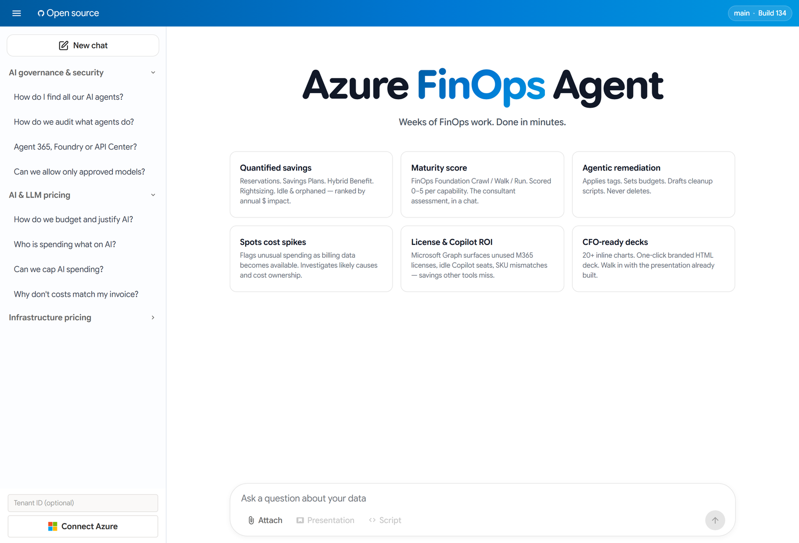
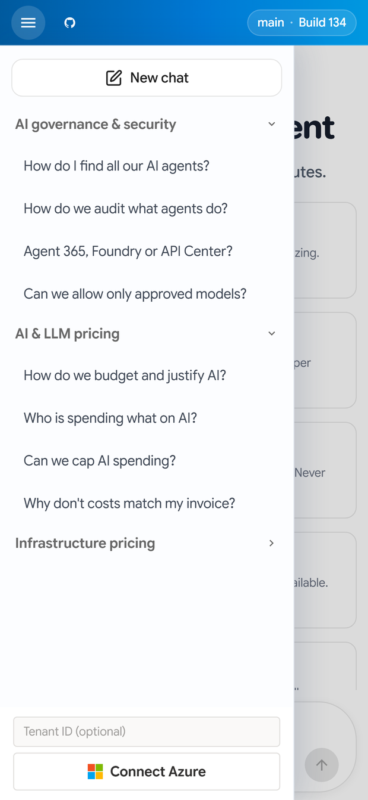
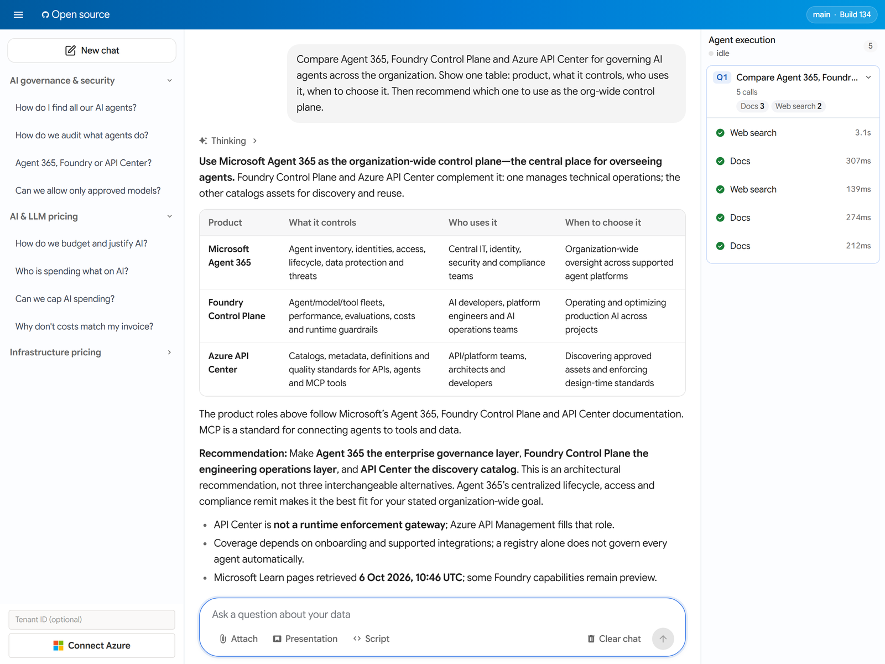
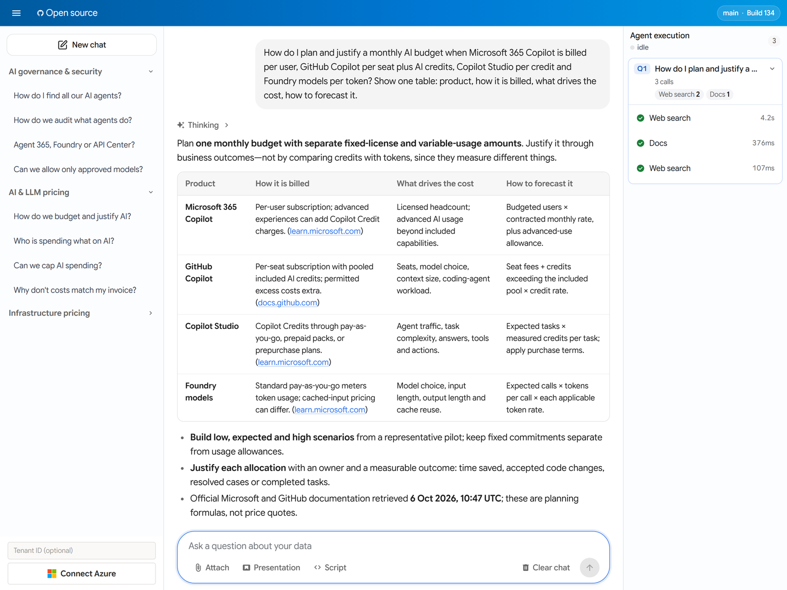
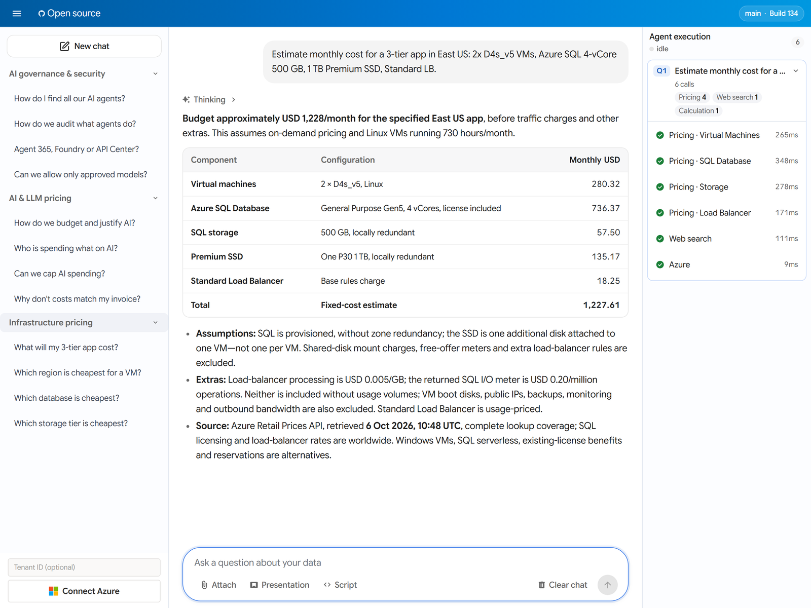
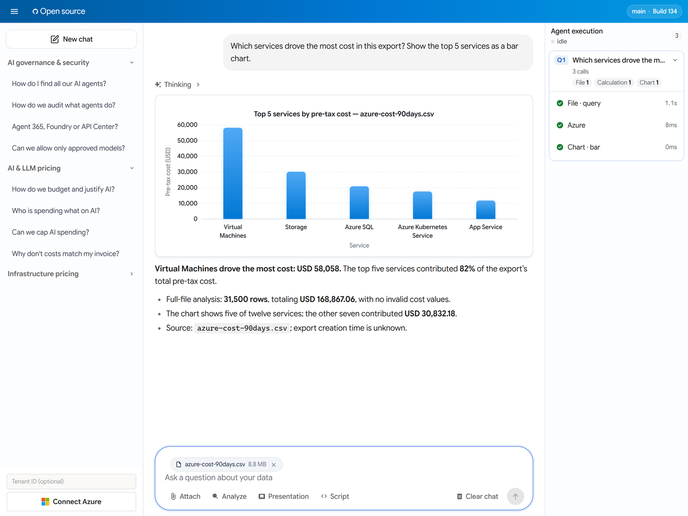
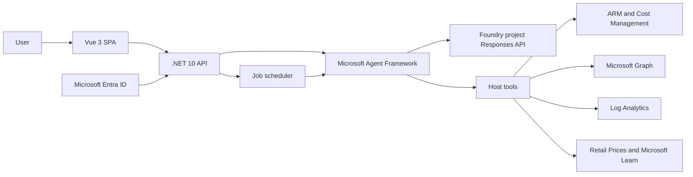

# Azure FinOps Agent

[](LICENSE)
[](https://github.com/Azure-Samples/azure-finops-agent/releases/latest)
[](https://dotnet.microsoft.com)
[](https://vuejs.org)

**Plain answers on AI governance, AI costs and your Azure spend.**

Azure FinOps Agent is an open-source AI agent for Azure. Ask it in plain words how to govern your AI agents, how to budget and cap AI spend, or what an Azure setup will cost. It answers from current Microsoft documentation and live Azure prices, and shows every call behind the answer. Connect your Azure tenant and it works with your own costs, budgets and resources: it finds savings, scores your FinOps maturity and drafts the fix, using only your own permissions. It never deletes Azure resources.

**[Try it now](https://azure-finops-agent.com)** · [Deploy to your Azure](#deploy-to-your-azure-subscription) · [Slides](https://azure-finops-agent.com/slides)



## See it in action

<p align="center">
  
  
</p>

<table>
  <tr>
    <td width="50%" valign="top">
      
      <p><b>AI governance.</b> Agent 365, Foundry Control Plane or API Center: a short comparison and a recommendation, from Microsoft Learn.</p>
    </td>
    <td width="50%" valign="top">
      
      <p><b>AI budgets.</b> How Microsoft 365 Copilot, GitHub Copilot, Copilot Studio and Foundry models are billed, and how to forecast each.</p>
    </td>
  </tr>
  <tr>
    <td width="50%" valign="top">
      
      <p><b>Cost estimates.</b> A 3-tier app priced from the Azure Retail Prices API, with what is included and what is left out.</p>
    </td>
    <td width="50%" valign="top">
      
      <p><b>Your own files.</b> Upload a cost export (here, the synthetic demo data) and get the top services as a chart.</p>
    </td>
  </tr>
</table>

The panel on the right lists every call behind an answer, so you can check where each figure came from. The screenshots are real answers; prices and guidance change over time.

## What you can ask

### Without signing in

The start page offers the questions customers ask most:

| AI governance & security           | AI & LLM pricing                  | Infrastructure pricing             |
| ---------------------------------- | --------------------------------- | ---------------------------------- |
| How do I find all our AI agents?   | How do we budget and justify AI?  | What will my 3-tier app cost?      |
| How do we audit what agents do?    | Who is spending what on AI?       | Which region is cheapest for a VM? |
| Agent 365, Foundry or API Center?  | Can we cap AI spending?           | Which database is cheapest?        |
| Can we allow only approved models? | Why don't costs match my invoice? | Which storage tier is cheapest?    |

You can also ask your own question about Azure prices or service health, or upload a CSV, TSV, JSON, Excel, PDF, Parquet, text or image file and ask about it. The [demo data](demo-data/README.md) has samples to try.

### After you connect Azure

- **Spend:** costs by service, subscription, resource group, tag and region, with forecasts and budgets.
- **Savings:** Azure Advisor, reservations and savings plans, and idle or orphaned resources.
- **Maturity:** a Crawl, Walk and Run FinOps score, with the evidence behind each rating.
- **More data, with your consent:** Microsoft 365 licenses and Copilot usage (Microsoft Graph), Log Analytics and Application Insights queries, and cost exports in Azure Storage. Each needs its own consent.
- **Scheduled jobs:** rerun a check on a schedule, such as a daily cost digest, a budget guard or an anomaly watch.
- **Deliverables:** charts, Excel and CSV reports, HTML presentations, and Azure CLI, PowerShell, Bicep or ARM scripts for you to review.
- **Approved changes:** for a change such as a tag or a budget, you see the exact request and approve it before it runs.

The agent acts with your own delegated permissions, so your Azure roles and the consents you grant set the limit. Deletes and other destructive actions are blocked in code; for those, it writes a script that you review and run yourself.

## Answers you can check

- **Sources and freshness:** figures come from calls you can see, with their source and retrieval time. Billed costs, budget snapshots, list prices and estimates are kept apart.
- **Unknown is not zero:** missing data, failed calls and partial coverage are stated, never shown as zero.
- **Activity is not savings:** a Copilot license with no reported activity, for example, is not proof that removing it saves money.
- **Real files:** scripts and reports are real downloads tied to your session, kept for 24 hours.
- **Done is not solved:** a finished answer is not proof the problem is fixed; proposed changes still need your approval.

The [tool and prompt catalog](docs/tool-catalog.md) documents the agent's 16 tools, the two Microsoft Learn documentation tools it uses, and their limits, and [reliability contracts](docs/agent-reliability.md) describe how answers are verified.

## How it works


```mermaid
flowchart LR
    User --> UI[Vue 3 SPA]
    UI --> API[.NET 10 API]
    API --> Agent[Microsoft Agent Framework]
    API --> Jobs[Job scheduler]
    Jobs --> Agent
    Agent --> Model[Foundry project Responses API]
    Agent --> Tools[Host tools]
    Tools --> ARM[ARM and Cost Management]
    Tools --> Graph[Microsoft Graph]
    Tools --> Logs[Log Analytics]
    Tools --> Public[Retail Prices and Microsoft Learn]
    Entra[Microsoft Entra ID] --> API
```

The app runs as one Linux container on Azure App Service. The Azure Developer CLI provisions Azure Container Registry, a Microsoft Foundry account and project, monitoring, managed identities, role assignments, App Service and, optionally, the Entra app registration for sign-in.

The agent can use only its registered tools, plus the model's hosted web search for recent public information (on by default). Search queries leave the Azure data boundary; set `AZURE_OPENAI_WEB_SEARCH=false` before `azd up` to turn it off. There is no shell, file system or code execution. Run one active instance, because session and throttling coordination is process-local.

## Deploy to your Azure subscription

### Prerequisites

- [Azure CLI](https://learn.microsoft.com/cli/azure/install-azure-cli)
- [Azure Developer CLI](https://learn.microsoft.com/azure/developer/azure-developer-cli/install-azd)
- An Azure subscription where you can create resources and role assignments
- Permission to create an Entra app registration, or an existing app registration to reuse

### Deploy

```powershell
az login --tenant <tenant-id>
az account set --subscription <subscription-id>
azd auth login
azd up
```

`azd up` asks for an environment name and region, provisions the stack, builds the image in Azure Container Registry and prints the app's URL. To reuse existing resources or change defaults, use `azd env set`; see [Azure deployment permissions](docs/azd-up-permissions.md) and [azure.yaml](azure.yaml).

Remove the deployment with:

```powershell
azd down --purge
```

## Run locally

### Prerequisites

- [.NET 10 SDK](https://dotnet.microsoft.com/download/dotnet/10.0)
- [Node.js 22+](https://nodejs.org/)
- Azure CLI signed in to the tenant that hosts your Microsoft Foundry project

Your Azure CLI identity also needs **Foundry User** (formerly Azure AI User) on the Foundry account that hosts the project. **Cognitive Services OpenAI User** covers only the account's OpenAI endpoints, not the project Responses endpoint, and management roles such as Owner don't include model-inference permissions. This is separate from signing in to your Azure tenant in the browser; see [local model authorization](CONTRIBUTING.md#local-model-authorization).

### Configure

```powershell
cd src\Dashboard
dotnet user-secrets set "AzureOpenAI:Endpoint" "https://<account>.services.ai.azure.com/api/projects/<project>"
dotnet user-secrets set "AzureOpenAI:DeploymentName" "<your-deployment>"
```

Optional settings:

- `AzureOpenAI:TenantId` when the model is in a different tenant from the Azure CLI default
- `AzureOpenAI:ProjectName` if `AzureOpenAI:Endpoint` is the account endpoint rather than the project endpoint
- `Microsoft:ClientId`, `Microsoft:ClientSecret` and `Microsoft:TenantId` to enable Azure sign-in locally
- `ApplicationInsights:ConnectionString` for telemetry

### Build and run

```powershell
cd src\Dashboard\frontend
npm ci
npm run build

cd ..
$env:ASPNETCORE_ENVIRONMENT = "Development"
dotnet run --urls http://localhost:5000
```

Open [http://localhost:5000](http://localhost:5000). Build the frontend before starting the backend, so the static web root exists at startup. The [contributor guide](CONTRIBUTING.md#regression-tests) covers the backend, Python, frontend and desktop/mobile browser regression tests.

## For maintainers

- [`/investigate-ai-sessions`](.github/skills/investigate-ai-sessions/SKILL.md) audits 100 real conversations end to end, finds recurring reasons answers fall short, and implements regression-tested local fixes. It never impersonates users, commits customer transcripts or deploys on its own.
- [`/investigate-logs`](.github/skills/investigate-logs/SKILL.md) triages exceptions in Application Insights.
- `npm run og-image` in `src/Dashboard/frontend` re-renders the social sharing card from [its HTML source](src/Dashboard/frontend/social/og-image.html).

## Security

- OAuth uses PKCE, nonce validation, incremental delegated consent and explicit resource scopes.
- The user's Azure roles (RBAC) and consented scopes remain the authorization boundary.
- Azure `DELETE` and mutating action `POST` operations are blocked in code.
- Generated downloads and conversation transcripts are checked against their owner.
- Changes through Azure Resource Manager need explicit approval in the app; chat text and scheduled prompts can't approve them.
- Budget figures can lag billing, and quota or placement evidence doesn't guarantee capacity.
- Keep production secrets in managed identities, App Service settings or GitHub Actions secrets, never in source control.

See [SECURITY.md](SECURITY.md) to report a vulnerability and [session management](docs/session-management.md) for how sessions behave.

## Contributing

See [CONTRIBUTING.md](CONTRIBUTING.md), [SUPPORT.md](SUPPORT.md) and the [Code of Conduct](CODE_OF_CONDUCT.md).

## Contact

Questions about this sample or delivering it for your organization: contact the maintainer, [Ali Reza Farahnak on LinkedIn](https://www.linkedin.com/in/alirezafarahnak/). Report bugs and feature requests as [GitHub issues](https://github.com/Azure-Samples/azure-finops-agent/issues).

## License

[MIT](LICENSE)
