# Minimal, Contract-Driven Architecture

The application stays a modular monolith: one .NET API and one Vue application. Simplification means fewer duplicated decisions and smaller testable modules, not new services or delegating security decisions to the model.

## Boundaries

```mermaid
flowchart LR
    Model[Copilot SDK and model] --> Admission[Protected tool admission]
    Admission --> Tool[Typed arguments and endpoint contract]
    Tool --> Transport[Shared HTTP and cost coordination]
    Transport --> Provider[Azure or Graph API]
    Provider --> Evidence[Bounded result and source evidence]
    Evidence --> Events[Correlated SSE events]
    Events --> State[Message and request-progress state]
    State --> View[Vue rendering]
```

| Boundary | Owns | Must not own |
| --- | --- | --- |
| Session/turn host | User/session identity, one active turn, cancellation, completion | Guessing whether an answer fulfilled the business goal |
| Protected tools | Admission, owner binding, redaction, execution leases | Model-controlled permissions or filesystem access |
| Tool contracts | Required/optional arguments, supported query options and scope | Generic filters unsupported by the source API |
| HTTP transport | Authentication, cancellation, service retry deadlines | Invented data or silently shortened retry deadlines |
| Evidence/results | Source date, currency, units, counts, paging and completeness | Treating unknown/denied/partial data as zero or complete |
| Client state | Message identity, authoritative snapshots, request progress | Erasing answers based on a tool-name list |
| Vue view | Rendering, accessibility and user interaction | Reimplementing transport policy |

## Implemented UI Simplification

- [assistantMessageStream.js](../src/Dashboard/frontend/src/assistantMessageStream.js) assembles text by SDK message ID. A final snapshot replaces only its own deltas. Later messages, including follow-ups, append without deleting earlier answers. Legacy streams retain a tool-boundary fallback.
- [requestProgress.js](../src/Dashboard/frontend/src/requestProgress.js) interprets generic HTTP status, retry deadline and retry eligibility. One reactive clock supplies a real countdown; slow responses, waiting retries and terminal cooldowns remain distinct.
- [RequestProgressCard.vue](../src/Dashboard/frontend/src/components/RequestProgressCard.vue) explains the service wait with a deadline-based countdown and restrained animation, without conflating wait progress with request completion. Reduced motion disables decorative animation; hidden tabs pause it.
- [AssistantAvatar.vue](../src/Dashboard/frontend/src/components/AssistantAvatar.vue) replaces text-circle avatars with one accessible brand mark. Only working replies animate, and every SVG instance has unique IDs.
- [turnRecovery.js](../src/Dashboard/frontend/src/turnRecovery.js) classifies owner-checked terminal outcomes without treating unavailable or mismatched history as proof of failure. A model authorization failure is separate from the user's tenant connection.
- [TurnFailureNotice.vue](../src/Dashboard/frontend/src/components/TurnFailureNotice.vue) renders the same accessible failure state for live and restored turns. [SessionEndpoints.cs](../src/Dashboard/Endpoints/SessionEndpoints.cs) preserves redacted SDK errors in transcript order without discarding partial answers. Editing a failed question never resends it automatically or replaces an existing draft.
- [jobTemplates.js](../src/Dashboard/frontend/src/data/jobTemplates.js) keeps editable scheduling prompts in data rather than component logic. Template guidance cannot approve purchases or invent missing resource names, and test jobs must not repeatedly query the tenant-throttled billing service.
- [ChatEndpoints.cs](../src/Dashboard/AI/ChatEndpoints.cs) forwards message and admitted tool-call identities. The browser no longer has to guess which running tool is waiting.
- [TurnExecution.cs](../src/Dashboard/AI/TurnExecution.cs) accounts for distinct completed messages without double-counting snapshots.
- [AzureQueryTools.cs](../src/Dashboard/AI/Tools/AzureQueryTools.cs) reuses the existing bulk transport for grouped multi-scope billing reads. The host forces cost-containing batches sequential, stops after a final throttle, and preserves source evidence when response bodies are omitted. This reduces model round-trips, not Azure's mandated wait time.

These modules use the existing Vue Composition API and standard JavaScript/.NET primitives. No additional state-management framework is needed.

## Flexible Parameters, Fixed Safety

Use typed arguments and bounded parameter bags for resource scope, period, filters, projection, grouping, paging and rendering. Derive the model-visible schema from the implementation rather than maintaining incompatible duplicate descriptions.

Keep source capabilities in endpoint-specific contracts. A parameter is useful only if the endpoint supports it. Flexibility must not mean guessing API versions, silently dropping filters, widening an explicit scope or fetching an entire collection to answer a small question.

The following remain deterministic host policy:

- Per-user/session ownership and exact tool-call admission.
- Approved request destinations and reserved host-owned fields.
- No Azure deletion and no unrestricted mutating POST.
- Exact stored PUT/PATCH approval in the application.
- Credential screening, redaction and sandboxed generated HTML.
- Cost Management serialization, full retry deadlines and final same-turn blocking.

Do not replace these controls with prompt wording or an AI judgement.

## Library and Refactor Rules

1. Reuse the existing SDK, ASP.NET Core, Vue reactivity, `HttpClient` and JSON facilities before adding dependencies.
2. Prefer a small shared parser/state module over another tool-specific branch in the main component.
3. Add a library only when it replaces meaningful custom code and preserves the existing security, cancellation and output contracts.
4. Prove each migration with focused unit tests, a browser reproduction and then authenticated acceptance on the same user-shared tab.
5. Keep public APIs and user-visible behavior stable unless the change is intentional and documented.

This document does not claim the entire tool catalog or large Vue component has already been rewritten. Backend consolidation should proceed in independently testable slices, not a high-risk replacement of the working application.

## Backend Review: Consolidate Only Where It Reduces Duplication

| Area | Next safe boundary | Decision |
| --- | --- | --- |
| ARM and Graph query contracts | Shared parsing with host-owned endpoint capability definitions | Graph query-option validation now uses a compact contract table and one parser/validator, preserving the existing allow/deny matrix. Keep ARM scope, grouping and mutation guards deterministic. Do not assume every API accepts every OData option. |
| Ledger filtering and paging | Existing `FilterLedger` implementation | Reuse the existing engine. Another abstraction would add code without removing meaningful duplication. Keep ownership, literal filters and totals-before-paging fixed. |
| HTTP and public-web reads | Small bounded-read/result-formatting helpers | Share mechanics where contracts match. Keep public HTTPS fetch separate from delegated ARM/Graph/Log Analytics transport; their credentials, retries and coverage rules differ. |
| Generated scripts | Existing thin artifact wrapper | Keep packaging separate from execution. A more flexible argument bag must not become arbitrary host execution. |

Prefer parameters for requested scopes, filters, columns, periods and page sizes. Keep endpoint capability facts and authorization policy in reviewed, host-owned definitions. New dependencies must replace enough custom code to justify their lifecycle and approved-feed requirements; moving a short, already-shared method to a new class is not simplification.
